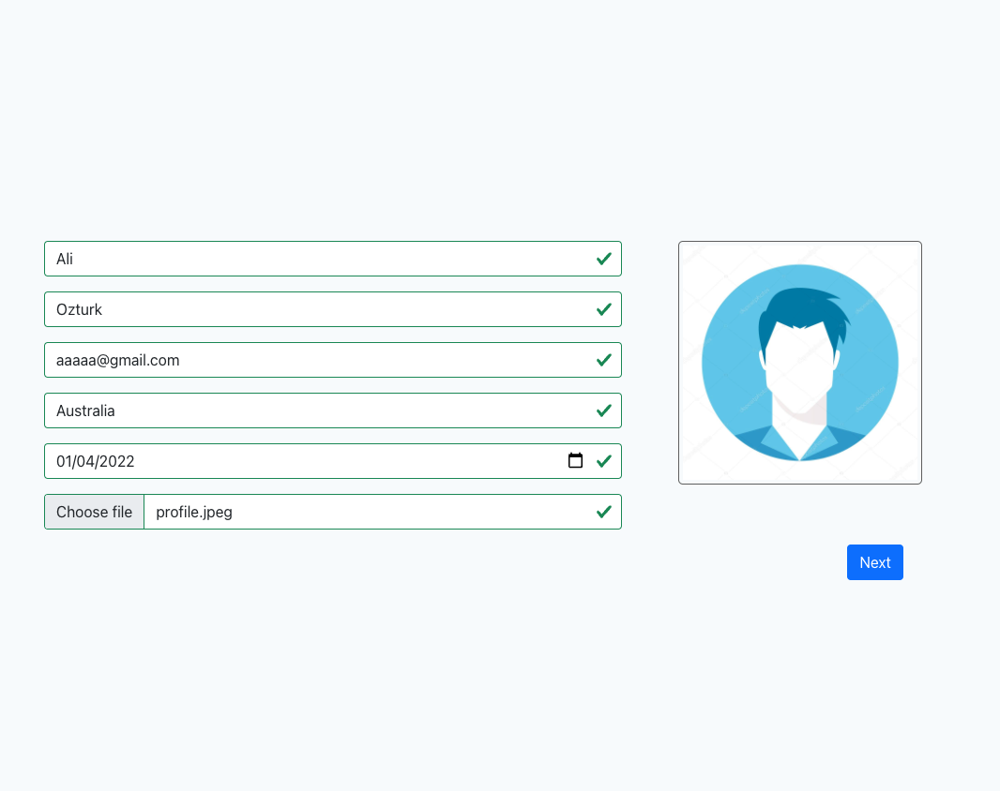
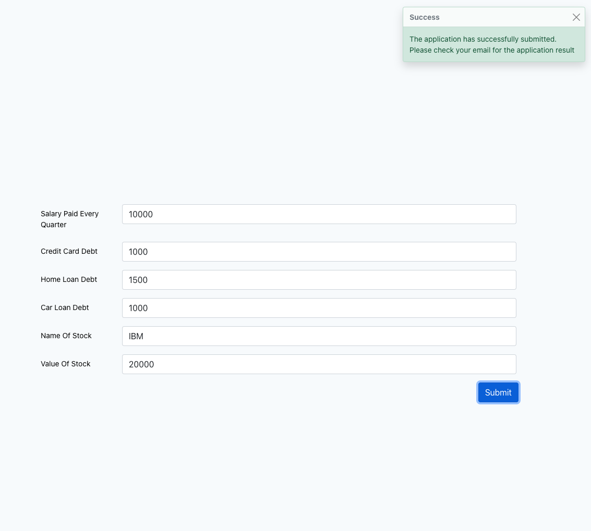
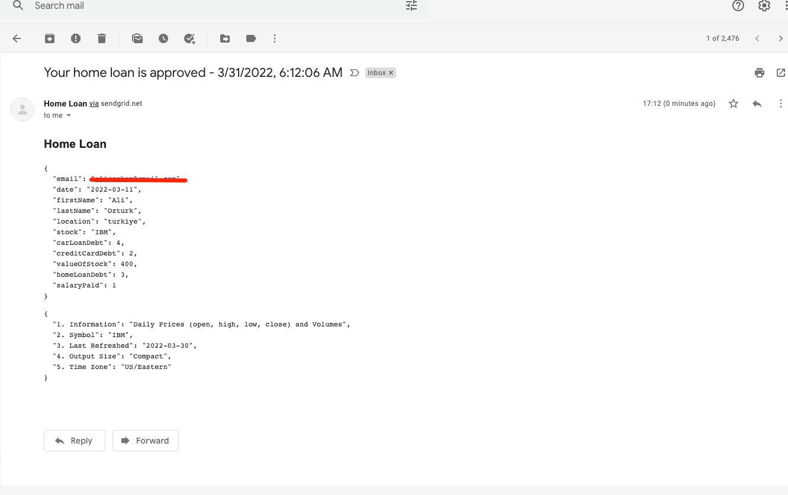

# RiskAssessment-Lambda
The goal of project is implementing a scalable and maintanable application with NodeJS.

# Rules
The Risk assessment application approves or rejects a home loan application based on the following rules; Approval is when total assets > total liabilities - Rejection is when total assets < total liabilities

# Rules
 The clean architecture and SOLID design principles applied to separate domain objects from external dependencies. This application can be deployed into Amazon, Azure, Google Cloud or run as a standalone application. 

### How to Test

You can submit a home loan application by clicking below link

    https://stellar-dango-840388.netlify.app/

Once you compile the project, deploy it using the serverless framework

    serverless deploy

You might need to set AWS keys in your local development machine.

#### Sample Screenshots

    

    

    

    

